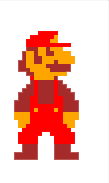
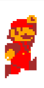
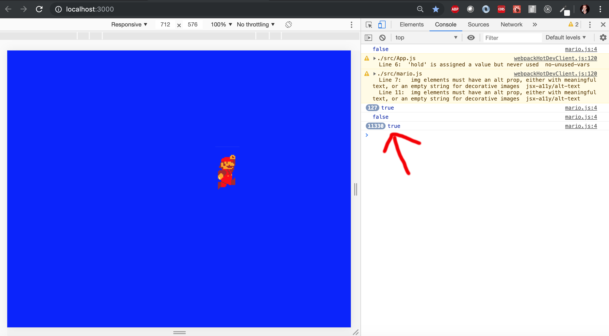

# Event Listener Animation Tutorial

# Contents

* Background
* Technologies
* Challenges and Solutions

# Background
Recently, I served as a Developer In Residence at DigitalCrafts, the full-stack coding bootcamp I completed earlier this year. In this role, I assisted students in another cohort to master the concepts and technologies introduced throughout the course, and provided individual assistance as they worked on their final projects. 

Unlike my cohort, whose final projects mostly consisted of daily assistant and organization apps, this class was encouraged to create web-based games using a PERN stack (PostGreSQL, Express, React/Redux and Node). These projects spanned the retro-gamut from open-world RPGs to turn-based fighters in the style of the early Pokémon Game Boy titles. 

One of the most common issues I was asked to assist with were rendering character attack animations: this included both rendering the events, as well as resolving a pesky “keydown” repeat event trigger that would cause each app to freeze up.

This application is by no-means a "complete" product, nor a proper presentation of my comprehensive CSS or React abilities. Rather, this was a quick demonstration I threw together for two groups with a solution that could be implemented in both of their projects. As it was such a common request, I decided to share the solution here to my GitHub.

For this illustration, I simply make the classic presentation of Mario from the original NES Super Mario Bros. game jump when the return/enter key is pressed.


# Technologies
- React
- HTML/CSS/JavaScript


# Challenges & Solutions
###   1. Event-based animation
First, we will establish an animation to take place on a “keydown” event. For this, I created a dummy component that would render a different image depending on its props. 

```
if(!props.jump){
        return(
            
        )
    }else{
        return(
            
        )
    }
```



For the second image, I created a "keyframes" animation lasting 1 second to illustrate the jump:

```
.marioJump{
    position:relative;
    top: 200px;
    left: 100px;
    width:50px;
    animation: jump 1s forwards;
}

@keyframes jump{
    0%{top: 200px }
    50%{top: 75px}
    100%{top:200px}
}
```



Next, I created the "keydown" listener that would execute the jump when the "return/enter" key is pressed.

```
    window.addEventListener('keydown', e =>{
      this.makeJump(e)
    }) 
```    
Notice, the below jumpDown() command returns Mario to his original state after a "setTimeout" of 1s, exactly when his "keyframes" animation ends.

```
 state={
    jump: false
  }

  makeJump = (e) =>{
    
      this.setState({
          jump:true
        });
        this.jumpDown();
  }  

  jumpDown = () =>{
    setTimeout(()=>{
      this.setState({
        jump: false
      })
    }, 1000)
  }
```
```
    return (
      <div className="App">
          <div className='marioWorld'>
              <Mario jump={this.state.jump}/> //sends state to dummy component as props.
          </div>
      </div>
    );
```

###   2. Fixing the KeyDown Freeze
We're not quiet there yet. You will notice that if you tap and hold the return key, our mustachioed-plumber friend continue to jump endlessly. Further, even holding down the key for more than 1s can rack up tens-of-thousands "state.jump === true" triggers, overloading the DOM and freezing our program.



Anyone how was fortunate enough to nab an NES classic while they were still available knows that if you hold down the A button, Mario only jumps once until you release the button (keyup) and press it (keydown) again. Fortunately, this is an easy fix. 

```
var hold = false
```

```
  makeJump = (e) =>{
    if (hold !== true){ // the "hold" functionality helps avoid keydown repeat
      this.setState({
          jump:true
        });
        this.jumpDown();
        hold = true   // *
    }
  }  
  ```

  By adding the hold condition to our keydown, we set it so that jump is only triggered if hold === false; here, hold is set to 'true' just after our state is set.

  To set it back to true, we establish a "keyup" event listener. 

  ```
    render(){
    window.addEventListener('keydown', e =>{
      this.makeJump(e)
    }) 
    window.addEventListener('keyup', e =>{
      this.keyUpListener(e) 
    }) 
```
```
  keyUpListener = (e) =>{
    if (e.keyCode === 13){
      hold = false 
    }
  }
```
There – now Mario behaves just like he did in good old 1985. If you wanted to set it so that Mario jumps again after each complete jump while "keydown", you could always used a setTimeout() function to trigger the "hold" condition to default to false in the makeJump() function after a given time, say 1.5s.

______________________________________________

I hope this simple illustration was helpful to any other students looking to develop a game using React/Redux.